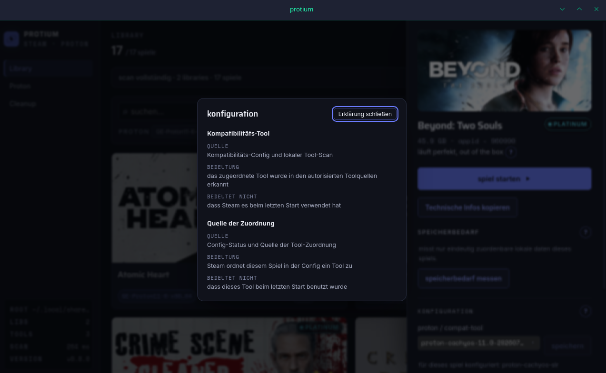

# protium

[deutsch](README.md) · **english**

[](https://github.com/Tzyber/protium-steam-play-proton-manager/actions/workflows/ci.yml)

**on my very first scan I saw that a game was set to a completely different
proton version than the one I thought I had set.** that is what protium is for.

protium shows you what Steam has actually set up on your machine, and it tells
you how sure it is. there is a question mark at the places that matter. behind
it you find where a value comes from, what it means, and what it does not mean.
when protium does not know something, it says so instead of guessing.

what you can do: start games, set launch options, install new proton versions,
see how well a game runs according to protondb, and find and clear out leftover
data from games you deleted long ago. all in one window.

it came into being because this exact tool did not exist. protonup-qt only
manages versions. protontricks is a winetricks wrapper. steamtinkerlaunch does
everything and is unwieldy for exactly that reason.

> one proton. one electron. the simplest atom in the universe, and roughly the amount of overhead this tool is meant to have.

### what you get to see

every value that claims something can explain itself. where it comes from,
what it means, and explicitly what it does not mean:



the library shows your games with their protondb rating and the tool Steam
actually assigns to them. you can filter by that too:


the proton section shows which versions are installed and which games depend
on them. new GE versions come straight from github:


cleanup finds shader caches, wine prefixes from games you deleted long ago and
the trash, each with its size. nothing gets deleted without asking, and only
when protium is sure:


## installing

grab the AppImage or Debian package from the [releases page](https://github.com/Tzyber/protium-steam-play-proton-manager/releases). make the AppImage executable and run it:

current version: `v0.8.0`.

```sh
chmod +x protium_0.8.0_amd64.AppImage
./protium_0.8.0_amd64.AppImage
```

the AppImage is not signed. if you don't like that, build it yourself (see dev setup). Debian-based systems can install the accompanying Debian package:

```sh
sudo apt install ./protium_0.8.0_amd64.deb
```

if nothing starts and no error message appears, fuse2 is usually missing. then either `sudo pacman -S fuse2` or run it once without fuse:

```sh
./protium_0.8.0_amd64.AppImage --appimage-extract-and-run
```

## what it does

**library overview.** every game across every library, external drives included, with cover art, size, the proton version assigned in Steam's configuration and protondb tier right on the card. the local scan appears immediately; protondb follows in the background. proton-check filters only `bronze`, `borked` and explicit tools not recognised in this scan. Steam and library files are read through a current, backend-canonical environment snapshot; local covers arrive as short-lived blob URLs from a bounded backend binary read. The app still works offline without granting local Steam paths to the webview.

**GE-proton manager.** installed versions with size and the information which
games have a known explicit mapping. install new releases straight from github
(streaming download with sha512 verification, cancellable, partial file
cleaned up), remove installed versions. distro protons such as proton-cachyos
are detected and marked read-only. they belong to the package manager, not to
us.

**compat tool and launch options.** set the proton version and launch options per game. write gate in front (steam-is-running check, backup, atomic rename), and a surgical vdf string patch instead of full serialisation, because otherwise steam's escaping and key order do not survive.

**cleanup.** find and clear orphaned wine prefixes and shader caches, in three separate areas: shader caches, wine prefixes, trash. shader caches are deleted outright. prefixes move to the trash within the same filesystem. space is freed only when the trash is emptied.

confirmation runs in the Vue dialog in the main window. the backend binds the
target, consequences, token, live checks and claim; the webview confirmation
itself is deliberately not a tamper-proof security boundary.

**launching games.** via `steam://rungameid/<appId>`. no launcher of its own, no process supervision.

**failure cases.** what is unreadable is shown as unreadable, not as an empty value. destructive actions ask beforehand and show concretely what would happen. where possible, there is a way back.

**explanations and diagnostic evidence.** a question-mark button explains technical values right where they appear (config states, tool source, scan coverage, footprint, protondb, cleanup blockades, incomplete deletions) with source, meaning and what the value explicitly does not mean; the terms follow the [glossary](docs/glossar.md). "copy technical information" puts a privacy-conscious report into the clipboard: fixed labels, status values, validated numbers and report-local aliases only, never names, paths or config contents. conservative hints in the launch-options draft warn about gamemoderun without `%command%`, an assignment behind `%command%` and an enabled `PROTON_LOG=1` assignment.

**accessibility.** fully keyboard operable, visible focus states, tabs following the WAI-ARIA pattern (arrow keys, roving tabindex), contrasts checked against WCAG AA, `prefers-reduced-motion` respected globally. font sizes in `rem` so the app scales with the system font size. interface in german and english, key parity guarded by a test.

### supported steam installations

- **native**: `~/.local/share/Steam` and `~/.steam/steam`
- **flatpak**: `~/.var/app/com.valvesoftware.Steam/.local/share/Steam`
- **discovery**: `discover_steam_environment` resolves only fixed candidates
  from the backend home directory and reads libraries from `libraryfolders.vdf`;
  webview-supplied library paths are not trusted.
- **symlinks**: root and library symlinks are canonicalised by the backend and
  checked against the current snapshot for every environment read.

snap (`~/snap/steam/`) is included from 0.1.7, but only tested against fixtures. nobody has verified it on a real snap system yet.

### restoring a prefix from the trash

protium deliberately has **no** restore function. once a game is reinstalled, `compatdata/<appId>` exists again, and moving something back automatically would have to decide which state wins. on top of that, a prefix may originate from a different proton version than the one currently selected. those are decisions for a human, not for a tool.

by hand it is one `mv`. the trash lives in the same library, the entry is named `compatdata_<appId>_<timestamp>`:

```sh
cd /path/to/SteamLibrary/steamapps
ls .protium-trash                       # find the entry
mv .protium-trash/compatdata_1477940_1785071505657 compatdata/1477940
```

important: the target `compatdata/<appId>` must not already exist. if it does, you have two states. back up the existing one first, then decide. steam recreates a missing prefix on the next launch, then without the old savegames.

## stack

tauri v2 as the shell, vue 3 and typescript for UI and domain logic, rust only for what the webview is not allowed to do. no electron; the binary stays small and uses the system webview (webkit2gtk).

concretely, rust only handles: just over 1000 productive lines for environment discovery and snapshot-authorised reads, path validation, streaming downloads with hashing, tarball extraction, the two delete commands and the process check. domain logic and UI decisions do not live in this layer. plus nearly 1800 lines of tests, almost twice as many as production code, because these paths modify and delete files.

the domain logic in `src/core/` is entirely UI-free and talks to the system only through ports and adapters. that lets the whole core test suite run headless against fixtures, no tauri, no steam, no network.

## dev setup

prerequisites (cachyos/arch):

```sh
sudo pacman -S --needed webkit2gtk-4.1 base-devel curl wget file openssl librsvg
rustup default stable   # if rust is missing: sudo pacman -S rustup
```

then:

```sh
npm install
npm test              # vitest, core headless against fixtures
npm run check         # biome (194 lint rules, 0 warnings) + vue-tsc --noEmit
(cd src-tauri && cargo test)   # rust: downloads, path validation, extraction, cleanup
npm run tauri dev     # start the app (the first build compiles rust, takes a while)
```

`npm run check`, `npm test` and the cargo tests also run in CI on every push and pull request.

the cache lives in `~/.cache/com.protium.desktop/`.

### dependencies and advisories

```sh
(cd src-tauri && cargo audit)
```

`.cargo/audit.toml` lists advisories that are knowingly accepted, each by ID with a reason, so that a **new** advisory still trips the check. these mostly concern tauri's GTK3 stack (the gtk-rs bindings are unmaintained; gtk-rs moved on to GTK4) and build-time-only crates. to be revisited once tauri moves to gtk-rs 0.20.

## layout

```
src/core/                    domain logic, UI-free. talks only through ports
src/core/adapters/tauri.ts   ports against plugin-fs/http + rust commands
src/ui/                      vue app: library, proton manager, cleanup, i18n
src-tauri/                   rust commands (extract, download, process check,
                             dir size, fs scope, delete paths)
tests/                       vitest against fake-steam fixtures
docs/                        screenshots, smoke checklist
```

rules for the implementation: writes to steam files go through the write gate without exception. destructive actions always ask and show concretely what would happen. path knowledge comes from `paths.ts`, not from assembled strings. a network outage may impoverish features but must never block the app. if a value cannot be determined reliably, the UI says `unknown`.

## roadmap

- [x] phase 1: core data layer (scan, vdf parsing, protondb, multi-library incl. external mounts)
- [x] phase 2: library UI (cover grid, tiers, warnings, search/filter/sort)
- [x] phase 3: GE-proton manager (install/remove, queue, distro tool detection, cancellable downloads)
- [x] game detail drawer with protondb link
- [x] phase 4: setting compat tool and launch options (write gate, backups, vdf string patch)
- [x] phase 5: cleanup of orphaned prefixes and shader caches, trash
- [x] launching games (steam protocol, no launcher of its own)
- [x] i18n (german/english)
- [x] CI: lint, typecheck and tests on every push
- [x] phase 6 (part 1): AppImage build in CI
- [x] v0.5.0: library first, protondb follow-up and proton-check
- [x] v0.6.0: scan truth with clear coverage and local detail facts
- [x] v0.6.1: incomplete deletions (claim restore, claim leftovers in cleanup)
- [x] v0.7.0: game footprint in the drawer
- [x] v0.7.1: refactored Rust layer, larger cleanup in manageable steps,
  clearer search and trash handling
- [x] v0.8.0: explainability (explanation buttons with source, meaning and
  limit), a data-minimal diagnostic record for copying and conservative
  launch-option/`PROTON_LOG` hints

version history lives in the [releases](https://github.com/Tzyber/protium-steam-play-proton-manager/releases).

## next

protium does not need to finish quickly. new versions only belong here when
they make local Steam data clearer without a daemon or auto-repair. with
this plan ahead:

- [x] before v0.8.0: [terminology glossary](docs/glossar.md)
- a separate prefix metadata spike remains open and independent, without
  claiming a runtime result in advance
- v0.9.0: honest GE mapping summary and a secure "open prefix folder" workflow
- v1.0.0: consolidation (consistency, error semantics, security and
  accessibility review)

the binding internal product plan is `protium-roadmap-v2(1).md`; older roadmap
documents in the repository are historical. every release still needs its own
accepted spec; Steam writes and deletions additionally need renewed explicit
approval.

## open points

open maintenance items. security boundaries are reviewed separately and before
refactors. work proceeds as convenient; the order is not a priority.

## status

under active development. api and UI change without notice. the roadmap describes the current state; it is not a promise of future versions.
